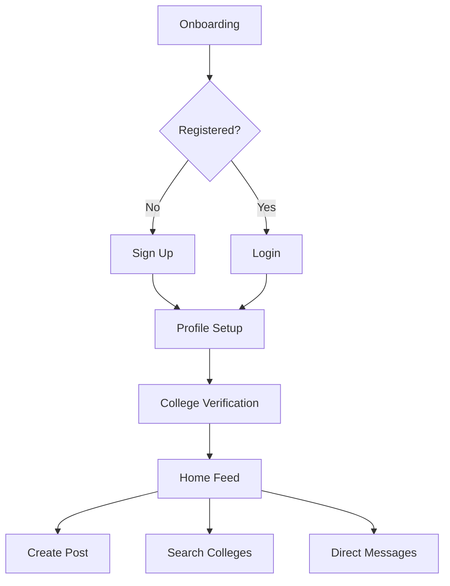

Got it! Based on your description, the app concept is a **platform that connects students with current students or alumni from specific colleges and universities**. The app will serve two main purposes:

1. **Guidance and Mentorship**:  
   - Students can seek advice, guidance, or information from current students or alumni of a specific college or university.
   - This helps prospective students or newcomers understand the culture, academics, and lifestyle of the institution.

2. **Engagement and Entertainment**:  
   - A platform for students to share funny moments, knowledge, ideas, and experiences.
   - This fosters engagement, builds a sense of community, and creates a fun, interactive environment.

Here’s how we can structure the app to meet these goals:

---

# App Concept: **CampusConnect**

## **App Overview**
CampusConnect is a mobile application designed to connect students with current students, alumni, and faculty from specific colleges and universities. It serves as both a **mentorship platform** and a **student engagement hub**. Users can:
- Seek guidance about college life, academics, admissions, etc.
- Share funny moments, knowledge, and experiences to engage with the community.

The app focuses on creating a **verified and pseudonymous environment** where users can interact safely and meaningfully.

---

## **Key Features**

### **1. Guidance & Mentorship**
- **College-Specific Channels**:  
  Users can join channels dedicated to specific colleges or universities.  
  - Example: "Harvard University," "MIT," "Stanford," etc.
- **Ask Questions**:  
  Users can post questions like:
  - "What’s the workload like at Stanford?"
  - "How are the dorms at NYU?"
- **Verified Responders**:  
  Only verified students or alumni from the respective college can answer questions. Verified users get a badge (e.g., "Verified Stanford Student").
- **Anonymous Mode**:  
  Users can ask questions anonymously if they don’t want to reveal their identity.

### **2. Engagement & Entertainment**
- **Forums for Sharing**:  
  - **Funny Moments**: Share memes, jokes, or funny stories about college life.
  - **Knowledge Sharing**: Post study tips, career advice, or interesting facts.
  - **Life Hacks**: Share tips for surviving college (e.g., "Best coffee spots near campus").
- **Upvotes & Comments**:  
  Users can upvote helpful or entertaining posts and comment to engage in discussions.
- **Tags & Categories**:  
  Posts can be tagged with categories like:
  - #Funny
  - #StudyTips
  - #Admissions
  - #LifeHacks

### **3. Searchable College Database**
- **College Profiles**:  
  Each college has a profile page with:
  - Basic info (location, ranking, programs offered).
  - User reviews and ratings.
  - Comparison tools to compare colleges side-by-side.
- **Map Integration**:  
  View colleges on a map with filters for location, type (public/private), and size.

### **4. Secure Messaging**
- **Direct Messaging**:  
  Verified users can message each other for private conversations.
- **Moderation Filters**:  
  Messages are filtered for inappropriate content using AI and human moderation.

---

## **Screens**

### **Authentication Flow**
| Screen     | Purpose                         | Components                           | Navigation           |
|------------|---------------------------------|---------------------------------------|----------------------|
| Login      | Entry point for registered users | Email Input Field, Password Input    | → Home/Register      |
| Register   | New account creation            | Username checker, Password rules     | → Verification       |
| Verification | College status confirmation  | Document upload, Live camera         | → Profile Setup      |

### **Core Application**
| Screen       | Components                     | Interactions                          |
|--------------|---------------------------------|---------------------------------------|
| Home Feed    | Post list, College filters, Create FAB | Infinite scroll, Post interactions   |
| Profile      | Avatar, Stats card, Content tabs | Edit profile, Privacy settings        |
| College Search | Map view, Filter chips, Results list | Detail navigation, Comparison         |
| Chat         | Conversation list, Message input | Verified user filtering, Moderation   |

### **Secondary Screens**
| Screen       | Purpose                        | Key Elements                          |
|--------------|---------------------------------|---------------------------------------|
| Settings     | Account management             | Privacy toggles, Delete account       |
| Notifications | User alerts                    | System/User alerts, Mark read         |
| Admin Dashboard | Content moderation          | Reports queue, Verification review    |

---

## **User Flow**

### **Primary User Journey**


### **Key Task Flows**
1. **Post Creation**  
   - Feed → FAB → Compose → Post type → Tag college → Publish  
   - Example: A student shares a funny meme and tags their college.

2. **College Search**  
   - Navbar → Search → Filters → Detail View → Save Comparison  
   - Example: A prospective student searches for "Top Engineering Colleges" and compares MIT vs. Stanford.

3. **Verification**  
   - Profile → Verify → Upload Docs → Live Photo → Submit → Await Approval  
   - Example: A current Harvard student uploads their ID and takes a live photo to verify their identity.

---

## **Prototype Description**

### **Visual Framework**

#### **Login Screen Prototype**
```plaintext
[Header] CampusConnect Logo
[Body]
- Email Input Field
- Password Input
- "Forgot Password?" Link
[Footer]
- "New here? Create Account" CTA
```

#### **Profile Screen Layout**
```plaintext
[Header] Back Button | Settings Gear
[Main]
- Avatar Circle (Generated from username)
- Display Name | Verification Badge
- Stats Card (Posts/Followers/Likes)
- Bio Section
[Tab Bar]
- Posts | Likes | College Content
```

### **Interaction Design**
- **Verified Badge Animation**: Pulse effect when verification completes.
- **Post Creation**: Bottom sheet modal with college tag selector.
- **College Search**: Map integration with pinch-to-zoom and location filtering.

---

## **Technical Priorities**

### **Security Foundation**
- Data encryption at rest and in transit.
- GDPR-compliant deletion flows.
- Regular third-party audits.

### **Performance Targets**
- <2s feed load time.
- <1s search results.
- 60fps scroll performance.

### **Technology Stack**
- **Frontend**:react native
- **Backend**: supabase

---

## **Success Metrics**
| Metric              | Target  |
|---------------------|---------|
| DAU/MAU Ratio       | >40%    |
| Verification Completion | >75%  |
| Avg Session Duration | >8min   |
| Content Reports     | <2% of posts |

---

This refined app concept ensures that the platform meets the dual purpose of **guidance and engagement**, while maintaining a focus on **security, verification, and user experience**. Let me know if you'd like further refinements!