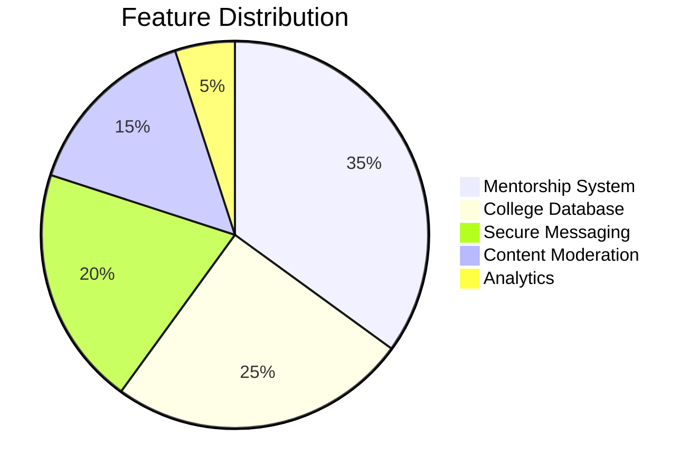

# CampusConnect Concept Document

## Overview
A social-academic platform connecting students, alumni, faculty across institutions for:
- Mentorship & guidance
- Community engagement
- Academic resource sharing
- College discovery

## Target Audience
- Prospective students (60%)
- Current undergraduates (25%)
- Alumni & faculty (15%)

## Key Features

## Value Proposition
| Aspect | Traditional Platforms | CampusConnect |
|--------|-----------------------|---------------|
| Verification | Self-reported | Institution-verified |
| Content Focus | General | Academic-centric |
| Security | Basic E2E | Military-grade + moderation |
| Search | Keyword-based | Semantic + Geo-filtered | 