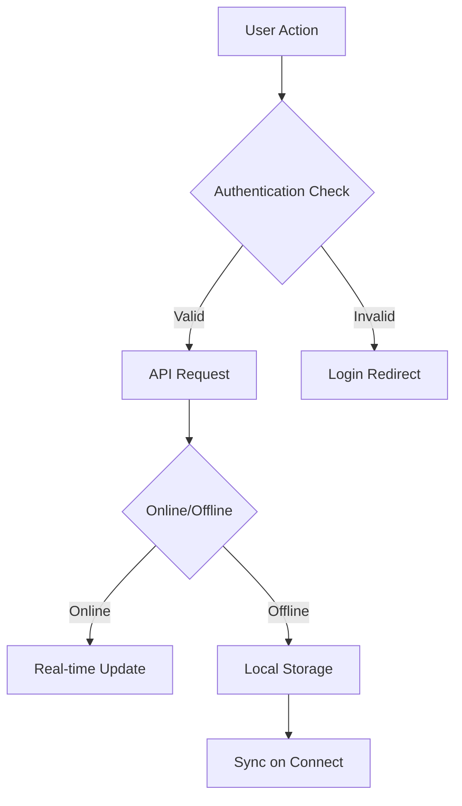

# CampusConnect Application Documentation

## 1. User Flows

### 1.1 Authentication Flow
1. **Registration**
   - Users enter full name, email, and password
   - Verification status check
   - Profile creation
   - Redirection to main app

2. **Login**
   - Email/password authentication
   - JWT token storage
   - Auto-login on token validity

3. **Verification**
   - Document upload
   - Status tracking (pending/verified)
   - College association

### 1.2 Core Navigation
- Bottom Tab Navigation
  - Home
  - Explore
  - Chat
  - Profile

## 2. Features & Functionality

### 2.1 College Exploration
- **Search & Filter**
  - College name search
  - Type filtering (Public/Private)
  - Ranking filters (Top 10, Top 50)
  - Tag-based filtering

- **College Details**
  - Basic information
  - Location with map integration
  - User reviews
  - Forums access
  - Comparison capability

- **College Comparison**
  - Side-by-side comparison
  - Key metrics comparison
  - Add/remove colleges

### 2.2 Communication
- **Forums**
  - College-specific forums
  - Real-time updates
  - Verified user distinction
  - File attachments
  - Message threading

- **Direct Messaging**
  - One-on-one chats
  - Media sharing
  - Read receipts
  - Online status
  - Message persistence

### 2.3 Profile Management
- **Profile Features**
  - Bio customization
  - College verification
  - Profile picture
  - Activity history

- **Settings**
  - Password change
  - Notification preferences
  - Privacy settings
  - Account management

## 3. Screen Details

### 3.1 Main Screens
1. **HomeScreen**
   - Post feed
   - New post creation
   - Interaction capabilities
   - Pull-to-refresh

2. **ExploreScreen**
   - College search
   - Filter implementation
   - College cards
   - Quick actions

3. **ChatScreen**
   - Message list
   - Real-time updates
   - Media handling
   - Chat actions

4. **ProfileScreen**
   - User info display
   - Stats overview
   - Post history
   - Verification status

### 3.2 Feature Screens
1. **CollegeDetailScreen**
   - College information
   - Map integration
   - Review system
   - Action buttons

2. **CompareCollegesScreen**
   - Comparison metrics
   - Visual comparison
   - Add college capability

3. **ForumsScreen**
   - Forum threads
   - Real-time updates
   - User verification
   - Posting capability

## 4. Technical Implementation

### 4.1 State Management
- Supabase real-time subscriptions
- Context API for auth state
- Local storage for offline data
- Memory caching

### 4.2 Data Flow


### 4.3 Key Functions

1. **Authentication**
```typescript
async function handleLogin(email: string, password: string)
async function handleRegister(userData: UserData)
async function verifyUser(document: File)
```

2. **Data Operations**
```typescript
async function fetchColleges(filters: FilterOptions)
async function compareColleges(collegeIds: string[])
async function sendMessage(content: string, attachments?: File[])
```

3. **User Actions**
```typescript
async function updateProfile(profileData: ProfileData)
async function postToForum(content: string, collegeId: string)
async function likePost(postId: string)
```

## 5. User Capabilities

### 5.1 General Users
- Browse colleges
- View public information
- Register/Login
- Basic profile creation

### 5.2 Verified Users
- Post in college forums
- Direct messaging
- Write reviews
- Compare colleges

### 5.3 College-Verified Users
- Special badge display
- Enhanced forum privileges
- Verified responses
- College ambassador status

## 6. Security & Performance

### 6.1 Security Measures
- JWT authentication
- File upload validation
- Content moderation
- Rate limiting

### 6.2 Performance Optimizations
- Image compression
- Lazy loading
- Data caching
- Offline support

## 7. Error Handling

### 7.1 User Feedback
- Toast notifications
- Error boundaries
- Loading states
- Retry mechanisms

### 7.2 Recovery Actions
- Auto-reconnect
- Data sync
- Session recovery
- Cache clearing

## 8. Future Enhancements

### 8.1 Planned Features
- Video chat
- Group messaging
- Advanced analytics
- AI-powered recommendations

### 8.2 Optimization Goals
- Reduced load times
- Better offline support
- Enhanced search
- Improved UI/UX

