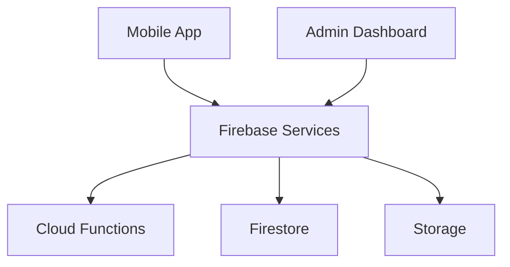

# CampusConnect Technical Documentation

## 1. Project Overview

### Purpose
CampusConnect is a social-academic platform designed to bridge the gap between prospective students, current students, and alumni through verified connections and meaningful interactions.

### Target Audience Distribution
- 60% Prospective students
- 25% Current undergraduates
- 15% Alumni & faculty

### Core Features
1. **Mentorship System (35%)**
   - Verified user connections
   - Academic guidance
   - Career counseling
   - Institution-specific advice

2. **College Database (25%)**
   - Comprehensive institution profiles
   - Comparison tools
   - Geographic search
   - Review system

3. **Secure Messaging (20%)**
   - End-to-end encryption
   - Real-time chat
   - File sharing
   - Group messaging

4. **Content Moderation (15%)**
   - AI-powered filtering
   - User reporting system
   - Content verification
   - Community guidelines

5. **Analytics (5%)**
   - User engagement metrics
   - Performance monitoring
   - Usage statistics
   - Behavior analysis

## 2. Technology Stack & Architecture

### Frontend
```kotlin
// Tech Stack
- Language: Kotlin
- Framework: Android SDK
- UI Framework: Jetpack Compose
- Architecture: MVVM
- Dependencies Management: Gradle
```

### Backend
```firebase
// Firebase Services
- Authentication
- Cloud Firestore
- Cloud Storage
- Cloud Functions
- Cloud Messaging
```

### System Architecture


## 3. Development Environment Setup

### Prerequisites Installation
```bash
# Install required tools
sdk install java 11.0.12-open
npm install -g firebase-tools
npm install -g @google-cloud/functions-framework
```

### Project Structure
```
campusconnect/
├── app/
│   ├── src/
│   │   ├── main/
│   │   ├── test/
│   │   └── androidTest/
├── functions/
│   ├── src/
│   └── tests/
├── docs/
└── config/
```

## 4. Module Implementation

### Authentication Module
```kotlin
// Sample Authentication Implementation
class AuthRepository @Inject constructor(
    private val firebaseAuth: FirebaseAuth
) {
    suspend fun signIn(email: String, password: String): Result<FirebaseUser> {
        return try {
            val result = firebaseAuth.signInWithEmailAndPassword(email, password).await()
            Result.success(result.user!!)
        } catch (e: Exception) {
            Result.failure(e)
        }
    }
}
```

### Database Schema
```firestore
// Firestore Collections Structure
users/
  ├── userId/
  │   ├── profile: Map
  │   ├── verification: Map
  │   └── settings: Map
colleges/
  ├── collegeId/
  │   ├── info: Map
  │   ├── stats: Map
  │   └── reviews: Collection
```

## 5. Testing Guidelines

### Unit Testing
```kotlin
@Test
fun `test user authentication`() = runTest {
    // Given
    val email = "test@example.com"
    val password = "password123"
    
    // When
    val result = authRepository.signIn(email, password)
    
    // Then
    assertTrue(result.isSuccess)
}
```

### Performance Testing
- Launch time: < 2 seconds
- Feed load: < 1 second
- Message delivery: < 500ms
- Memory usage: < 100MB

## 6. Deployment Process

### Production Deployment
```bash
# Build and deploy
./gradlew assembleRelease
firebase deploy --only hosting
firebase deploy --only functions
```

### Monitoring Setup
```javascript
// Performance monitoring configuration
firebase.performance();
firebase.analytics();
```

## 7. Security Measures

### Data Protection
- End-to-end encryption for messages
- Secure storage for user data
- Regular security audits
- Compliance with GDPR and CCPA

### Authentication Security
- Multi-factor authentication
- Session management
- Rate limiting
- IP blocking

## 8. Maintenance Procedures

### Regular Updates
- Weekly security patches
- Monthly feature updates
- Quarterly performance reviews
- Annual security audits

### Backup Procedures
```bash
# Automated backup script
firebase firestore:backup
gsutil cp backup.json gs://backup-bucket/
```

## 9. Additional Resources

### Documentation Links
- [Concept Document](doc/concept.md)
- [Setup Guide](doc/setup.md)
- [Development Plan](doc/development_plan.md)

### API Documentation
- [Authentication API](api/auth.md)
- [Database API](api/database.md)
- [Messaging API](api/messaging.md)

### Design Resources
- UI/UX Guidelines
- Brand Assets
- Component Library

## 10. Troubleshooting

### Common Issues
1. Authentication Failures
   - Check network connection
   - Verify credentials
   - Check Firebase console

2. Performance Issues
   - Monitor memory usage
   - Check database queries
   - Analyze network calls

### Support Contacts
- Technical Lead: tech.lead@campusconnect.com
- Security Team: security@campusconnect.com
- DevOps: devops@campusconnect.com 